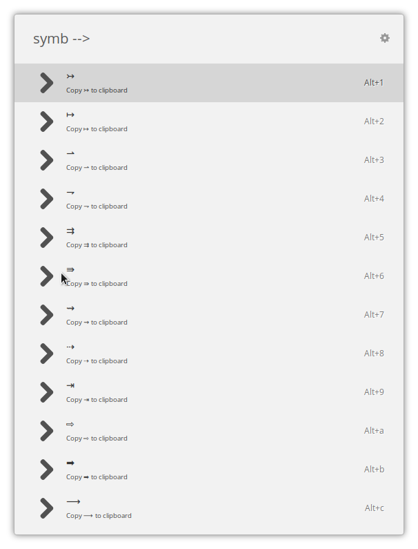

# Symbols Extension for ULauncher

## A very simple extension for ULauncher to get special symbols

The keyword is set to `symb` and the available symbol sets are:

- `-->`  ↦, ⇀, ⇁, ⇉, ⇛, ⇝, ⇢, ⇥, ⇨, ➡, ⟶
- `<--`  ↤, ↼, ↽, ⇇, ⇚, ⇜, ⇠, ⇤, ⇦, ⬅, ⟵
- `<->`  ⇹, ⇼, ⥎, ⥐, ⇋, ⇌, ⇄, ↹, ⬌, ⟷
- `UP>`  ↥, ↾, ↿, ⇈, ⇞, ⇡, ⇧, ⥣, ⤊, ⟰, ⬆
- `DN>`  ↧, ⇂, ⇃, ⇊, ⇟, ⇣, ⇩, ⥥, ⤋, ⟱, ⬇
- `O>`  ⮊, ⮈, ⮉, ⮋, ⭮, ⭯, ⮌, ⮎, ⮍, ⮏
- `CHECK`  ✓, ✔, ☑, ✗, ✘, ☒
- `FRAC`  ½, ⅓, ⅔, ¼, ¾, ⅛, ⅜, ⅝, ⅞, ‰, ‱
- `HEART`  💗, 💓, 💔, 💟, 💕, 💖, 💘, 💝, 💞
- `MATH`  π, ∞, Σ, ÷, ±, Ω, μ, λ, ρ
- `SUBNUM`  ₀, ₁, ₂, ₃, ₄, ₅, ₆, ₇, ₈, ₉
- `SUPNUM`  ⁰, ¹, ², ³, ⁴, ⁵, ⁶, ⁷, ⁸, ⁹
- `SEX`  ♂, ♀, ⚥, ⚤, ⚣, ⚢, ☿
- `MEDIA` ◀️, ⏪, ⏮️, ⏭️, ⏩, ▶️, ⏸️, ⏯️, ⏺️, ⏹️, ⏏️
- `ZODIAC`  ♈, ♉, ♊, ♋, ♌, ♍, ♎, ♏, ♐, ♑, ♒, ♓
- `ROMAN`  Ⅰ, Ⅱ, Ⅲ, Ⅳ, Ⅴ, Ⅵ, Ⅶ, Ⅷ, Ⅸ, Ⅹ, Ⅺ, Ⅻ, Ⅼ, Ⅽ, Ⅾ, Ⅿ
- `MAC`  ⌘, ⌃, ⌥, ⇧, ⇪, ⌫, ⏏, ⎋, ␣, ↩

## What's to come

I will be including more sets in the list as soon as I'll need them. If you'd like to have a special set included, please feel free to submit a patch.

## Changelog

- 23 APR 2020 Uploaded first working version of the program. Had to battle with quite a few hickups, but now everything runs smoothly.

- 24 APR 2020 Added 'MEDIA' set.
- 02 MAY 2020 Updated 'MATH' set.
